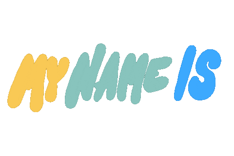

### Well hello there! 👋

My name is Luca...

I am a Jr. Software developer and tester, passionate about learning new technologies and looking for my first opportunity to join the IT workforce.
  
  - 🌎 I'm based in San Carlos de Bariloche, Río Negro, Patagonia, Argentina. 🇦🇷 🇦🇷 🇦🇷
  - 📫 How to reach me: [Linked-In](https://www.linkedin.com/in/lucabp/).
  - 👨🏻‍💻 I enjoy coding Java with the Spring Framework and developing APIs and microservices.
  - 🤓 Currently enrolled in the Certified Tech Developer Program thought and designed by Mercado Libre and Globant at Digital House.
  - 🌱 I am also learning to build systems using [Go](https://go.dev/).

### Skills:

 
  
  
  
  
  
  
  
  
  
  
  
  
  
  
  
  
  

